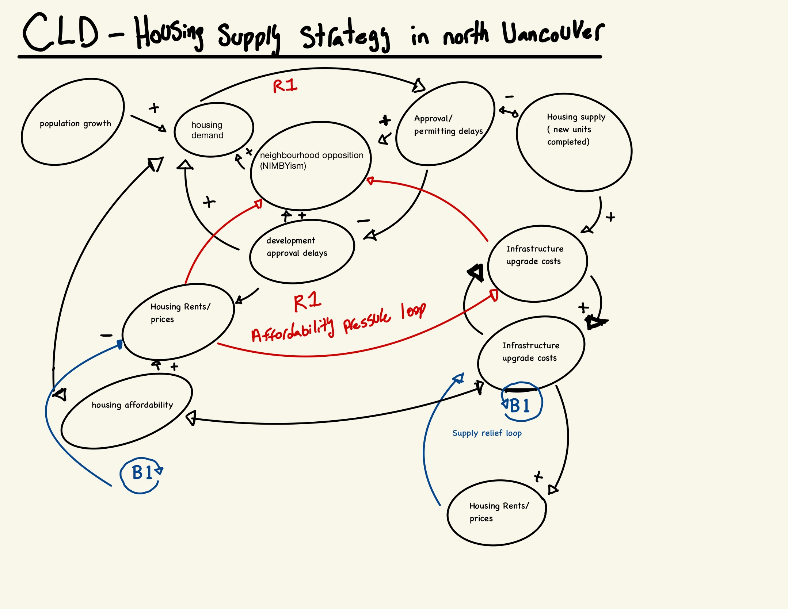
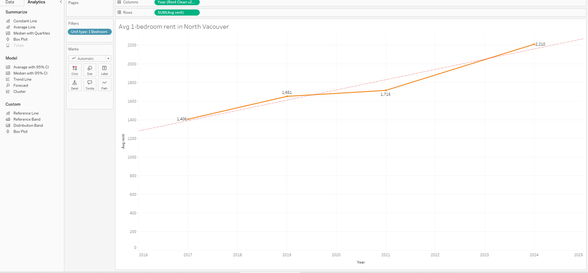
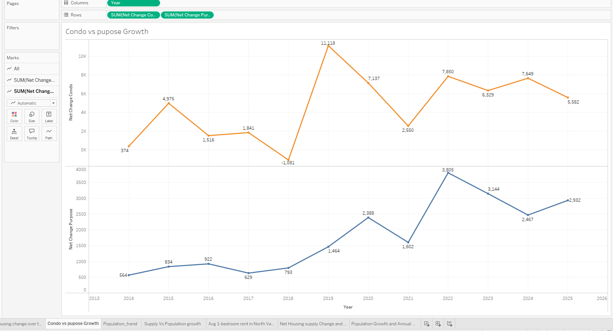
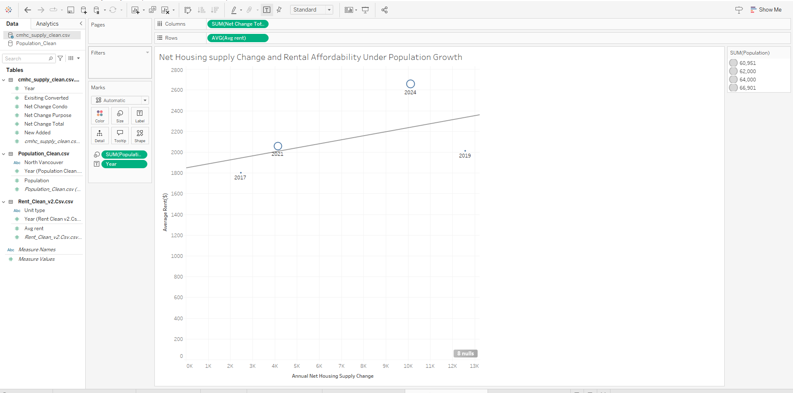
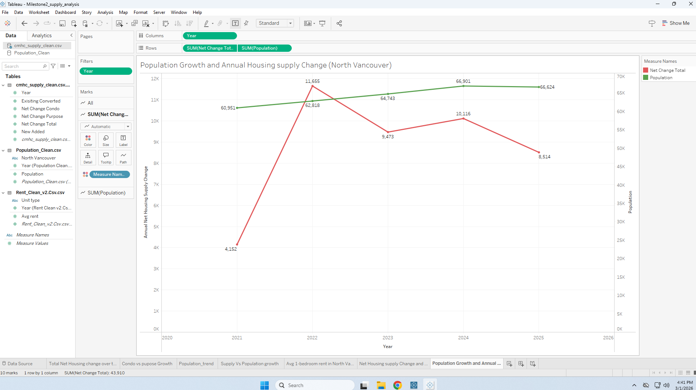

# Housing Supply Strategy in North Vancouver
README.md

Housing Supply Strategy in North Vancouver: Densification vs. Greenfield Constraints

​​## Decision Statement
Should the Director of Planning for the City of North Vancouver prioritize missing-middle densification within existing neighbourhoods to address housing affordability under land and infrastructure constraints between 2026 and 2029?

## Executive Summary
The City of North Vancouver faces persistent housing affordability challenges driven by strong regional demand, geographic constraints, and limited developable land. As part of the Metro Vancouver region, the city attracts residents seeking proximity to employment centres, transit access, and urban amenities. However, physical barriers such as mountains and waterways, combined with an already built-out urban form, leave little opportunity for greenfield suburban expansion. As a result, housing supply has struggled to keep pace with demand, contributing to low vacancy rates and rising housing costs.
The Director of Planning must decide whether to more aggressively prioritize missing-middle densification, including duplexes, triplexes, secondary suites, coach houses, and small apartment buildings, as the primary strategy to increase housing supply. While densification offers potential benefits such as more efficient land use, reduced sprawl, and better use of existing infrastructure, it also introduces tensions related to neighbourhood opposition, infrastructure strain, and development approval delays. These factors create uncertainty around whether densification policies can deliver meaningful affordability improvements in the short to medium term.
This project applies decision intelligence and systems thinking to support this planning decision. Rather than focusing solely on descriptive housing trends, the analysis examines how feedback loops between housing demand, prices, political resistance, infrastructure capacity, and approval timelines shape outcomes over time. The objective is to provide evidence-based insights that help the Director of Planning choose a strategy that improves affordability while remaining feasible within local and provincial constraints.

## Initial Causal Loop Diagram

## MileStone 2 Changes

## Milestone 2: Data Source
This analysis draws on three primary datasets to examine housing affordability dynamics in North Vancouver. Housing supply data was obtained from the Canada Mortgage and Housing Corporation (CMHC) and includes annual net housing change, new units added, and changes in housing stock composition. This dataset measures how responsive housing construction has been over time. Population data was sourced from Statistics Canada and provides annual estimates used to represent structural housing demand pressure. Finally, rental market data was derived from the CMHC Rental Market Survey, focusing on average 1-bedroom rent levels to assess affordability outcomes. Together, these datasets allow for analysis of the interaction between demand growth (population), supply response (housing construction), and market outcomes (rent levels), forming the empirical foundation for the refined Causal Loop Diagram.

## Average 1-Bedroom Rent Trend (2014–2024)
The time-series analysis of average 1-bedroom rent shows a steady and uninterrupted upward trend over the full study period. There are no sustained periods of rent decline, even during years of stronger housing construction. This persistent upward movement reinforces the dominance of the Reinforcing Demand Pressure Loop (R1) in the CLD. As Housing Demand increases, Rent Levels rise, which improves Development Viability and stimulates Housing Construction. However, because construction does not consistently keep pace with demand growth, affordability continues to decline. The rent trend demonstrates that affordability pressures are structural rather than temporary.

## Net Housing Supply vs. Population Growth
This dataset directly compares overall housing growth with overall population growth. Population growth is smooth and predictable, while housing supply remains more volatile and reactive. In multiple periods, demand growth exceeded supply growth, creating sustained imbalance in the system. This imbalance illustrates the interaction between the reinforcing and balancing loops in the CLD. When population growth exceeds housing expansion, the Reinforcing Demand Pressure Loop strengthens. When supply temporarily increases, the Balancing Supply Response Loop activates, but not at a scale sufficient to stabilize the system. The data therefore supports the conclusion that demand pressures currently dominate the housing system in North Vancouver.

## Net Housing Supply vs. Average Rent 
This dataset analyzes the relationship between annual net housing supply change and average rent levels. The scatter analysis shows that higher supply years do not correspond with meaningful rent decreases. While increased construction may slightly moderate rent growth in certain years, the overall trend in rents remains upward. This connects directly to the Balancing Supply Response Loop (B1) in the CLD, where Net Housing Supply is expected to reduce Rent Growth. The data suggests that this balancing effect exists but is weak relative to sustained demand pressures. As a result, the balancing loop is present in the system but is insufficient to counteract the stronger reinforcing demand loop.

## Population Growth vs. Net Housing Supply
This dataset compares steady population growth with annual net housing supply change in North Vancouver. The population trend shows a consistent and gradual upward trajectory across the study period, indicating sustained demand growth. In contrast, housing supply fluctuates significantly from year to year, with periods of strong expansion followed by weaker growth. In several years, population growth outpaced housing expansion. This pattern supports the Reinforcing Demand Pressure Loop (R1) in the CLD, where Population Growth increases Housing Demand, which places upward pressure on Rent Levels. Because supply does not consistently match demand growth, pressure accumulates within the system, strengthening the reinforcing loop and contributing to long-term affordability strain.

## Refined CLD

### Explanation of Key Feedback Loops and Implications for the Decision

#### Reinforcing Loop (R1): Demand Pressure Loop
The first dominant structure in the system is the reinforcing demand pressure loop (R1). In this loop, population growth increases housing demand (+), which drives average rent and home prices upward (+). Rising prices improve development viability (+), encouraging more housing construction (+) and increasing net housing supply (+). However, as shown in the data, the pace of new supply does not consistently match the rate of demand growth. As a result, rental prices continue to rise and affordability continues to decline, reinforcing the cycle.
This pattern is supported by the visualizations, which show steady population growth alongside consistently increasing rent levels. Even during periods of higher construction activity, rent levels do not decrease, indicating that demand pressure remains strong and persistent within the system.

**Implication:**  
Without intervention, this reinforcing loop will continue to drive rents upward. Incremental increases in supply are not sufficient to stabilize affordability because demand growth remains strong and predictable.

#### Balancing Loop (B1): Supply Response Loop
The second key structure is the balancing supply response loop (B1). In this loop, increased housing construction expands net housing supply (+), which should reduce rent growth (−) and ease affordability pressure. Lower affordability pressure should, in theory, stabilize the system over time.
However, the data suggests that this balancing mechanism is relatively weak. While increases in supply do have some moderating effect on rent growth in certain years, they do not reverse the overall upward trend in rental prices. This indicates that supply responses are not large enough or consistent enough to offset demand-driven pressures.
Additionally, approval delays act as a constraint within this loop. Increased development activity can lead to longer approval timelines, which slows the rate at which new housing supply is delivered, further weakening the balancing effect.

**Implication:**  
The balancing loop exists, but it is not strong enough to counteract the reinforcing demand loop. For supply to meaningfully impact affordability, increases must be sustained and supported by more efficient development processes.

#### Overall System Implication for the Decision
The interaction between these two loops explains why affordability pressures persist in North Vancouver. The reinforcing demand loop (R1) remains dominant, while the balancing supply loop (B1) is present but insufficient.
From a decision-making perspective, this suggests that policy intervention is required to strengthen the balancing loop. The most effective leverage points in the system include reducing approval delays and enabling more consistent and long-term housing supply increases. Without addressing these structural constraints, the system will not self-correct, and affordability challenges will continue to intensify.

## System Archetype anaylsis 

### Archetype: Limits to Growth
The housing system in North Vancouver reflects the **Limits to Growth** archetype. In this structure, an initial reinforcing process creates pressure for growth, but that growth is eventually slowed by structural constraints. In this project, population growth increases housing demand, which contributes to rising rents and stronger development incentives. These forces encourage additional housing construction and create pressure for supply expansion.

However, the system does not continue growing smoothly. The response of housing supply is constrained by factors such as approval delays, neighbourhood resistance, and limited infrastructure capacity. These balancing pressures slow the pace at which new housing can be delivered. As a result, even though demand continues to rise, supply does not expand quickly or consistently enough to keep up.

This archetype fits the evidence from the project. Population growth is relatively steady, while housing supply is more volatile and rental prices continue to rise over time. This suggests that the issue is not simply a lack of development activity, but the presence of system limits that prevent supply from scaling at the pace needed to improve affordability. In North Vancouver, the key issue is not whether growth exists, but whether the system can respond to growth before affordability pressures intensify further.

### Mapping the Archetype to North Vancouver
In North Vancouver, the reinforcing side of the archetype begins with **population growth**, which increases **housing demand**. Rising demand contributes to higher **rent levels**, which improves **development viability** and creates incentives for more **housing construction**. This is the growth side of the system.

The limiting side of the archetype comes from the supply constraints identified in the refined causal loop diagram. As development activity increases, the system encounters limits such as **approval delays**, **neighbourhood opposition**, and pressure on **infrastructure capacity**. These factors slow the rate at which new housing supply can come online. This means the system continues to experience strong demand pressure, but supply expansion is delayed or weakened.

This structure helps explain why affordability pressures persist even when construction occurs. The system is not lacking movement; it is being constrained by limits that reduce the effectiveness of the supply response.

### Evidence That This Archetype Is Operating
The visualizations from Milestone 2 support the Limits to Growth pattern. The population trend shows steady and continued demand growth over time, while housing supply changes are more uneven. The rent trend also shows that affordability pressure persists despite periods of additional housing construction. Together, these patterns suggest that supply is responding, but not at a scale or speed that is sufficient to offset growing demand. This is consistent with a system in which reinforcing growth pressures are being constrained by structural limits.

## Scenario Narratives

### Scenario 1: Status Quo
If the City of North Vancouver continues with its current approach to housing development, the system is likely to follow the same Limits to Growth pattern observed in the data. Population growth will continue to increase housing demand, placing upward pressure on rent levels and overall housing costs. As shown in the reinforcing loop (R1), this sustained demand will continue to drive development interest and housing construction activity.

However, the balancing loop (B1) will continue to constrain the system. Approval delays, neighbourhood opposition, and infrastructure limitations will slow the pace at which new housing supply can be delivered. Even as developers respond to high rents and strong demand, the time required to move projects through the approval process will limit how quickly new units enter the market.

Over the next 5–10 years, this likely results in continued upward pressure on rent levels and worsening affordability. Housing supply may increase in certain years, but not consistently enough to match demand growth. This leads to a persistent imbalance, where affordability challenges intensify despite ongoing development activity.

A key uncertainty in this scenario is whether external policy changes at the provincial level could alter approval timelines or zoning constraints. However, without meaningful local intervention, the system will remain dominated by the reinforcing demand loop, and affordability pressures are expected to continue rising.

### Scenario 2: Moderate Densification Strategy
If the City of North Vancouver implements a moderate densification strategy, the system begins to shift, but key constraints remain. In this scenario, the city introduces some zoning changes to allow for increased missing-middle housing, such as duplexes, triplexes, and secondary suites. This creates a more consistent increase in housing construction compared to the status quo.

As a result, the balancing loop (B1) becomes slightly stronger. Increased housing construction leads to greater net housing supply, which begins to moderate rent growth. However, approval delays and neighbourhood opposition still limit how quickly these changes can take effect. While supply improves, it does not fully keep pace with ongoing population growth.

Over a 5–10 year period, this scenario likely results in slower rent increases rather than a reversal of affordability challenges. Housing becomes somewhat more accessible, but pressures remain, particularly for lower- and middle-income households. The reinforcing loop (R1) is still active, as demand continues to grow steadily.

One key uncertainty in this scenario is the consistency of policy implementation. If zoning changes are applied unevenly or approvals remain slow, the impact on supply may be limited. While this approach improves conditions compared to the status quo, it may not be sufficient to significantly reduce affordability pressures in the long term.

### Scenario 3: Aggressive Densification and Process Reform
If the City of North Vancouver adopts an aggressive densification strategy combined with streamlined approval processes, the structure of the system begins to shift more significantly. In this scenario, the city expands missing-middle zoning at scale and actively reduces approval delays by simplifying permitting processes and increasing administrative capacity.

These changes strengthen the balancing loop (B1) by allowing housing construction to respond more quickly and consistently to rising demand. As new housing supply increases more steadily over time, the gap between population growth and available housing begins to narrow. While rent levels may not decrease immediately, the rate of rent growth is likely to slow more noticeably compared to the previous scenarios.

Over a 5–10 year period, this scenario results in improved system responsiveness. Housing supply becomes more aligned with demand, reducing the intensity of affordability pressures. However, this approach is not without risks. Increased development activity may create additional strain on infrastructure and could lead to stronger neighbourhood opposition, which may reintroduce constraints into the system if not managed carefully.

A key uncertainty in this scenario is the political feasibility of implementing large-scale reform. While this approach offers the strongest potential to improve affordability outcomes, it requires sustained policy commitment and coordination. Despite these challenges, this scenario presents the most promising pathway for shifting the balance between reinforcing demand pressures and supply constraints.

## Leverage Point Analysis
The most effective leverage point in the North Vancouver housing system is reducing approval delays and improving the efficiency of the development process. This point offers high impact relative to effort because it directly affects the system’s ability to convert development demand into actual housing supply.

In the current system, approval delays act as a key constraint within the balancing loop (B1). Even when demand is strong and development viability is high, delays in permitting and approvals slow the rate at which new housing can be delivered. This weakens the ability of housing supply to respond to demand, allowing the reinforcing demand loop (R1) to dominate and drive continued rent increases.

By reducing approval delays, the system becomes more responsive. Housing construction can increase more consistently, which strengthens the balancing loop and helps moderate rent growth over time. This intervention does not require eliminating demand pressures, but instead improves how effectively the system responds to them.

However, this leverage point is not without risks. Faster approvals may lead to increased development pressure, which could intensify neighbourhood opposition or strain infrastructure capacity. If these factors are not managed carefully, they could reintroduce constraints into the system and weaken the long-term effectiveness of the intervention.

Despite these risks, improving the development approval process remains the most practical and impactful intervention point. It directly addresses the system’s primary limitation and provides the strongest opportunity to rebalance the relationship between housing demand and supply.

## Implications for the Decision
The analysis suggests that North Vancouver’s housing system is currently dominated by reinforcing demand pressures driven by steady population growth. While housing construction does respond to rising demand, it does not do so consistently or quickly enough to prevent ongoing increases in rent levels. This indicates that the system is constrained by structural limits, rather than a lack of development activity.

Comparing the three scenarios, the status quo appears to be the least promising option. It allows demand pressures to continue increasing without strengthening the system’s ability to respond, leading to worsening affordability over time. The moderate densification scenario provides some improvement by increasing supply, but it does not sufficiently address the underlying constraints that limit system responsiveness.

The aggressive densification and process reform scenario offers the most promising pathway. By strengthening the balancing loop through faster approvals and more consistent supply growth, this approach improves the system’s ability to respond to demand pressures. While it does not immediately eliminate affordability challenges, it reduces the rate at which they intensify.

However, there are important uncertainties to consider. Political resistance, infrastructure capacity, and implementation consistency may affect how effective these interventions are in practice. These factors introduce risk into even the most promising scenario.

Overall, the analysis suggests that maintaining the current approach is unlikely to improve affordability outcomes. More proactive intervention is required to strengthen the system’s response to demand. This provides a strong foundation for recommending targeted policy changes in the next stage of the project.
